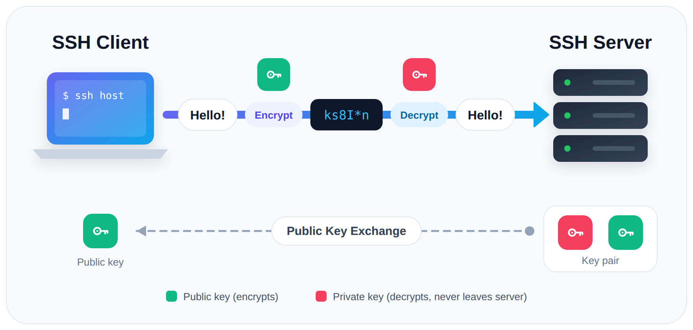

# Ubuntu CLI

Rev. 21 | Created: 2026-07-06 | Updated: 2026-09-30 12:42 CDT

> Commands in this document are written for **Ubuntu**.

## 1. Users

On Ubuntu, the interactive `adduser`/`deluser` tools are recommended. (`useradd`/`userdel` also exist but require specifying each option manually.)

### 1.1 Create a user

```bash
sudo adduser username    # Create account + home directory; prompts for password and details
```

- Automatically creates the home directory (`/home/username`), a default group, and a login shell.
- Prompts interactively for the password, full name, and other details.

### 1.2 List users

```bash
getent passwd                                     # List all accounts (system + human)
cut -d: -f1 /etc/passwd                            # List just the usernames
awk -F: '$3>=1000 && $3<65534 {print $1}' /etc/passwd   # Human users only (UID 1000-65533)
```

- On Ubuntu, regular (human) accounts start at UID 1000; lower UIDs are system accounts.
- `who` / `w` — Show users currently logged in (not all accounts).

### 1.3 Verify a user

```bash
id username              # Show UID, GID, and group membership
getent passwd username   # Show the /etc/passwd entry
ls -ld /home/username    # Show home directory owner and permissions
```

### 1.4 Delete a user

```bash
sudo deluser username                  # Delete account only (home directory remains)
sudo deluser --remove-home username    # Delete account together with the home directory
```

- `--remove-home` — Also removes the home directory (`/home/username`).
- Deletion may be refused if the user still has running processes. Terminate those processes first.

### 1.5 Grant sudo privileges

```bash
sudo usermod -aG sudo username   # Add the user to the sudo group
```

- On Ubuntu, the administrator (sudo) group is named `sudo`.
- `-aG` — Adds to the given group (`-G`) while keeping existing groups (`-a`). Using `-G` without `-a` replaces all existing supplementary groups, so be careful.

## 2. Files & Permissions

### 2.1 Change ownership

Change the owner of everything in the current directory (for example, from `root` to a specific user):

```bash
sudo chown -R username:username .    # Recursively set owner and group to username
```

- `-R` — Recursive; applies to all files and subdirectories underneath.
- `username:username` — `owner:group` format; changes the group as well.
- `.` — The current directory. Use an explicit path (`/path/to/dir`) if preferred.

Variants:

```bash
sudo chown -R username .        # Change owner only (leave group unchanged)
sudo chown -R username: .       # Change owner and set group to username's primary group
sudo chown -R :groupname .      # Change group only
```

- Target `.` (not `./*`) to include the current directory itself and hidden dotfiles; `./*` skips names starting with `.`.
- By default only the symlink itself is changed, not its target.
- Check before and after with `ls -la`.

## 3. Network

### 3.1 Show IP addresses

```bash
hostname -I                    # All IP addresses of this host, space-separated
ip addr                        # Full interface details (addresses, state, MAC)
ip -4 addr show scope global   # IPv4 addresses on external interfaces only
```

- `hostname -I` — Quickest way to get the machine's IP(s); excludes loopback (`127.0.0.1`).
- Use the LAN address (e.g. `192.168.x.x`) when connecting from another host on the same network.

### 3.2 Show MAC address

```bash
ip link                                    # MAC address (link/ether) of every interface
cat /sys/class/net/eth0/address            # MAC of a specific interface (replace eth0)
ip link show eth0                          # MAC of one interface with its state
```

- In `ip link` output, the MAC follows the `link/ether` label.
- List interface names first with `ls /sys/class/net` (e.g. `eth0`, `ens33`, `wlan0`, `lo`).
- `lo` (loopback) has a fixed all-zero MAC (`00:00:00:00:00:00`); ignore it.

### 3.3 Check connectivity and open ports

```bash
ping <host>                    # Test reachability to a host or IP
ss -tlnp                       # List listening TCP ports and owning processes
ss -tlnp | grep 8001           # Check whether a specific port is listening
```

- `ss -tlnp` shows `0.0.0.0:PORT` (all interfaces, reachable externally) vs `127.0.0.1:PORT` (local only).

## 4. Sudo

Ways to avoid typing `sudo` in front of every command.

### 4.1 Open a root shell

```bash
sudo -i    # Root login shell (root's environment)
sudo -s    # Root shell (keep current environment)
```

- The prompt changes to `#`; commands then run without a `sudo` prefix.
- Authenticate once with your own password.
- Always `exit` when done — do not linger in a root shell.

### 4.2 Extend the sudo password timeout

By default sudo caches authentication for 5 minutes. To change it, edit the sudoers file safely:

```bash
sudo visudo
```

Add or edit this line:

```
Defaults        timestamp_timeout=30
```

- The value is in minutes (`30` = no re-prompt for 30 minutes).
- `-1` means never expire until logout — not recommended for security.
- Always edit via `visudo`; it validates syntax and prevents breaking sudoers.

### 4.3 Group several commands under one sudo

```bash
sudo bash -c 'apt update && apt install -y curl && systemctl restart docker'
```

- Chaining with `&&` inside a single `sudo` prompts for the password only once.

### 4.4 Re-run the previous command with sudo

```bash
sudo !!    # Repeat the last command with sudo prepended
```

## 5. SSH

### 5.1 Connect to another Linux host

```bash
ssh <USER>@<HOST_IP>          # Log in to a remote host as <USER>
ssh ubuntu@192.168.0.10       # Example
```



Fig 1. SSH encrypts traffic with keys exchanged between client and server

### 5.2 Connection options

Table 1. SSH connection options

| Case | Command |
|---|---|
| Default port (22) | `ssh user@192.168.0.10` |
| Custom port (e.g. 2222) | `ssh -p 2222 user@192.168.0.10` |
| Private key file (`.pem`, `id_rsa`) | `ssh -i /path/to/key.pem user@192.168.0.10` |

---

## Appendix A. Terminology

- **apt**: Package manager of Ubuntu; installs, updates, and removes software packages.
- **CLI**: Command-line interface; text commands typed in a terminal.
- **daemon**: Background process with no terminal, usually started at boot.
- **dotfile**: File or directory whose name starts with `.`; hidden from plain `ls`.
- **GID**: Group ID; number that identifies a group.
- **GNOME**: Default desktop environment of Ubuntu.
- **GUI**: Graphical user interface; windows, icons, and mouse input.
- **home directory**: Personal directory of a user, `/home/<USER>`.
- **interface**: Network connection point of a host, physical or virtual (e.g. `eth0`, `wlan0`, `lo`).
- **IP address**: Numeric address of a host on a network (e.g. `192.168.0.10`).
- **LAN**: Local area network; hosts on the same local network segment.
- **login shell**: Shell started at login; reads the login profile of the user.
- **loopback**: Virtual interface `lo` through which a host reaches itself (`127.0.0.1`).
- **MAC address**: Hardware address of a network interface, fixed per device.
- **port**: Number from 0 to 65535 that identifies a service on a host.
- **primary group**: Group given to new files of a user; one per user.
- **private key**: Secret half of a key pair; decrypts or signs, never shared.
- **public key**: Shareable half of a key pair; encrypts or verifies.
- **root**: Superuser account with full privileges (UID 0).
- **service**: Program managed by systemd, usually a daemon.
- **shell**: Program that reads and runs typed commands (e.g. `bash`).
- **Snap**: Package format of Canonical that bundles an app with its dependencies.
- **SSH**: Secure Shell; encrypted protocol for remote login and command execution.
- **sudo**: Command that runs another command with root privileges.
- **sudoers**: Configuration file `/etc/sudoers` that defines who may use sudo.
- **supplementary group**: Additional group of a user beyond the primary group.
- **symlink**: Symbolic link; file that points to another path.
- **systemd**: Init system and service manager of Ubuntu; controlled with `systemctl`.
- **target**: systemd unit that groups services into a system state (e.g. `multi-user.target`).
- **TCP**: Connection-oriented transport protocol used by SSH and most network services.
- **UID**: User ID; number that identifies a user account.

## Appendix B. Reducing System Resource Usage

Main ways to cut CPU, RAM, and disk usage so that Ubuntu runs lighter and faster.

### B.1 Switch to CLI-only mode

On a server or a terminal-oriented machine, turning off the desktop GUI (GNOME) alone saves about 1–1.5 GB of RAM or more.

```bash
sudo systemctl set-default multi-user.target    # Boot into text (terminal) mode by default
sudo systemctl set-default graphical.target     # Restore GUI mode at boot
```

- Takes effect from the next boot.
- `startx` — Starts the GUI on demand while in text mode.

### B.2 Disable unneeded boot services

Background daemons that start at boot hold memory even when unused.

```bash
systemd-analyze blame                                  # Startup time taken by each service
systemctl list-units --type=service --state=running    # Services currently running
```

Services often left running without need:

```bash
sudo systemctl disable --now snapd.service snapd.socket    # Snap daemon, if no Snap apps are used
sudo systemctl disable --now bluetooth.service             # Bluetooth, if unused
sudo systemctl disable --now ModemManager.service          # Modem control, if no modem card is installed
sudo systemctl disable --now cups.service                  # Printer support, if no printer is used
```

- `disable --now` — Stops the service immediately and prevents it from starting at boot.
- Re-enable with `sudo systemctl enable --now <SERVICE>`.

`disable --now` is the same as running `stop` and `disable` separately:

```bash
sudo systemctl stop bluetooth       # Stop now
sudo systemctl disable bluetooth    # Do not start at boot
```

### B.3 Clean up unused packages and cache periodically

```bash
sudo apt autoremove --purge -y    # Remove unused dependency packages
sudo apt clean                    # Delete the apt package cache to free disk space
```

- `--purge` — Also removes the configuration files of the deleted packages.
- `apt clean` — Empties `/var/cache/apt/archives`; packages are downloaded again when reinstalled.
