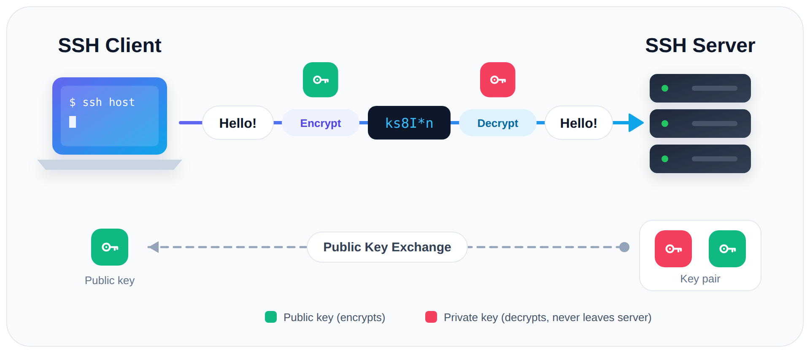

# Ubuntu CLI (Korean)

Rev. 0 | Created: 2026-09-30 | Updated: 2026-09-30 14:26 UTC

> 이 문서의 명령은 **Ubuntu** 기준이다.

## 1. Users

Ubuntu 에서는 대화형 도구인 `adduser`/`deluser` 를 권장한다. (`useradd`/`userdel` 도 있지만 option 을 하나하나 직접 지정해야 한다.)

### 1.1 Create a user

```bash
sudo adduser username    # Create account + home directory; prompts for password and details
```

- home directory (`/home/username`), 기본 group, login shell 을 자동으로 만든다.
- 비밀번호, 이름 등 세부 정보를 대화형으로 묻는다.

### 1.2 List users

```bash
getent passwd                                     # List all accounts (system + human)
cut -d: -f1 /etc/passwd                            # List just the usernames
awk -F: '$3>=1000 && $3<65534 {print $1}' /etc/passwd   # Human users only (UID 1000-65533)
```

- Ubuntu 에서 일반 (사람) 계정은 UID 1000 부터 시작하고, 그보다 낮은 UID 는 system 계정이다.
- `who` / `w` — 현재 로그인한 사용자만 표시 (전체 계정 아님).

### 1.3 Verify a user

```bash
id username              # Show UID, GID, and group membership
getent passwd username   # Show the /etc/passwd entry
ls -ld /home/username    # Show home directory owner and permissions
```

### 1.4 Delete a user

```bash
sudo deluser username                  # Delete account only (home directory remains)
sudo deluser --remove-home username    # Delete account together with the home directory
```

- `--remove-home` — home directory (`/home/username`) 도 함께 삭제.
- 그 사용자의 process 가 아직 실행 중이면 삭제가 거부될 수 있다. 먼저 그 process 를 종료한다.

### 1.5 Grant sudo privileges

```bash
sudo usermod -aG sudo username   # Add the user to the sudo group
```

- Ubuntu 에서 관리자 (sudo) group 의 이름은 `sudo` 이다.
- `-aG` — 기존 group 을 유지하면서 (`-a`) 지정한 group 에 추가 (`-G`). `-a` 없이 `-G` 만 쓰면 기존 supplementary group 이 모두 대체되므로 주의한다.

## 2. Files & Permissions

### 2.1 Change ownership

현재 directory 안의 모든 것의 소유자를 바꾼다 (예: `root` 에서 특정 사용자로):

```bash
sudo chown -R username:username .    # Recursively set owner and group to username
```

- `-R` — 재귀; 아래의 모든 file 과 하위 directory 에 적용.
- `username:username` — `owner:group` 형식; group 도 함께 변경.
- `.` — 현재 directory. 원하면 명시적 경로 (`/path/to/dir`) 사용.

변형:

```bash
sudo chown -R username .        # Change owner only (leave group unchanged)
sudo chown -R username: .       # Change owner and set group to username's primary group
sudo chown -R :groupname .      # Change group only
```

- 현재 directory 자신과 숨은 dotfile 까지 포함하려면 `./*` 가 아닌 `.` 을 대상으로 한다; `./*` 는 `.` 으로 시작하는 이름을 건너뛴다.
- 기본적으로 symlink 자체만 바뀌고 그 대상은 바뀌지 않는다.
- 변경 전후에 `ls -la` 로 확인한다.

## 3. Network

### 3.1 Show IP addresses

```bash
hostname -I                    # All IP addresses of this host, space-separated
ip addr                        # Full interface details (addresses, state, MAC)
ip -4 addr show scope global   # IPv4 addresses on external interfaces only
```

- `hostname -I` — machine 의 IP 를 가장 빨리 확인하는 방법; loopback (`127.0.0.1`) 제외.
- 같은 network 의 다른 host 에서 접속할 때는 LAN 주소 (예: `192.168.x.x`) 를 쓴다.

### 3.2 Show MAC address

```bash
ip link                                    # MAC address (link/ether) of every interface
cat /sys/class/net/eth0/address            # MAC of a specific interface (replace eth0)
ip link show eth0                          # MAC of one interface with its state
```

- `ip link` 출력에서 MAC 은 `link/ether` label 뒤에 나온다.
- 먼저 `ls /sys/class/net` 으로 interface 이름을 확인한다 (예: `eth0`, `ens33`, `wlan0`, `lo`).
- `lo` (loopback) 는 MAC 이 모두 0 (`00:00:00:00:00:00`) 으로 고정되어 있으니 무시한다.

### 3.3 Check connectivity and open ports

```bash
ping <host>                    # Test reachability to a host or IP
ss -tlnp                       # List listening TCP ports and owning processes
ss -tlnp | grep 8001           # Check whether a specific port is listening
```

- `ss -tlnp` 는 `0.0.0.0:PORT` (모든 interface, 외부에서 접근 가능) 와 `127.0.0.1:PORT` (local 전용) 를 구분해 보여준다.

## 4. Sudo

명령마다 앞에 `sudo` 를 입력하지 않는 방법.

### 4.1 Open a root shell

```bash
sudo -i    # Root login shell (root's environment)
sudo -s    # Root shell (keep current environment)
```

- prompt 가 `#` 로 바뀌고, 이후 명령은 `sudo` 없이 실행된다.
- 자신의 비밀번호로 한 번만 인증한다.
- 작업이 끝나면 반드시 `exit` 한다 — root shell 에 머물지 않는다.

### 4.2 Extend the sudo password timeout

sudo 는 기본적으로 인증을 5분간 기억한다. 바꾸려면 sudoers file 을 안전하게 편집한다:

```bash
sudo visudo
```

아래 줄을 추가하거나 고친다:

```
Defaults        timestamp_timeout=30
```

- 값의 단위는 분이다 (`30` = 30분 동안 다시 묻지 않음).
- `-1` 은 logout 전까지 만료되지 않음을 뜻한다 — 보안상 권장하지 않는다.
- 항상 `visudo` 로 편집한다; 문법을 검사해 sudoers 가 깨지는 것을 막는다.

### 4.3 Group several commands under one sudo

```bash
sudo bash -c 'apt update && apt install -y curl && systemctl restart docker'
```

- 하나의 `sudo` 안에서 `&&` 로 이어 붙이면 비밀번호를 한 번만 묻는다.

### 4.4 Re-run the previous command with sudo

```bash
sudo !!    # Repeat the last command with sudo prepended
```

## 5. SSH

### 5.1 Connect to another Linux host

```bash
ssh <USER>@<HOST_IP>          # Log in to a remote host as <USER>
ssh ubuntu@192.168.0.10       # Example
```



Fig 1. SSH 는 client 와 server 가 주고받은 key 로 통신을 암호화한다

### 5.2 Connection options

Table 1. SSH 접속 option

| Case | Command |
|---|---|
| 기본 port (22) | `ssh user@192.168.0.10` |
| port 변경 (예: 2222) | `ssh -p 2222 user@192.168.0.10` |
| private key file (`.pem`, `id_rsa`) | `ssh -i /path/to/key.pem user@192.168.0.10` |

---

## Appendix A. Terminology

- **apt**: Ubuntu 의 package manager. software package 를 설치·갱신·삭제.
- **CLI**: Command-line interface. terminal 에 입력하는 text 명령 방식.
- **daemon**: terminal 없이 background 에서 도는 process. 보통 부팅 시 시작.
- **dotfile**: 이름이 `.` 으로 시작하는 file 이나 directory. 그냥 `ls` 로는 보이지 않음.
- **GID**: Group ID. group 을 식별하는 번호.
- **GNOME**: Ubuntu 의 기본 desktop 환경.
- **GUI**: Graphical user interface. window, icon, mouse 입력 방식.
- **home directory**: 사용자의 개인 directory, `/home/<USER>`.
- **interface**: host 의 network 연결 지점. 물리 또는 가상 (예: `eth0`, `wlan0`, `lo`).
- **IP address**: network 에서 host 를 가리키는 숫자 주소 (예: `192.168.0.10`).
- **LAN**: Local area network. 같은 local network 구간의 host 들.
- **login shell**: login 할 때 시작되는 shell. 사용자의 login profile 을 읽음.
- **loopback**: host 가 자기 자신에 접속하는 가상 interface `lo` (`127.0.0.1`).
- **MAC address**: network interface 의 hardware 주소. 장치마다 고정.
- **port**: host 에서 service 를 구분하는 0–65535 사이의 번호.
- **primary group**: 사용자가 만드는 새 file 에 붙는 group. 사용자당 하나.
- **private key**: key pair 중 비밀인 쪽. 복호화나 서명에 쓰며 공유하지 않음.
- **public key**: key pair 중 공개하는 쪽. 암호화나 서명 검증에 씀.
- **root**: 모든 권한을 가진 superuser 계정 (UID 0).
- **service**: systemd 가 관리하는 program. 보통 daemon.
- **shell**: 입력한 명령을 읽어 실행하는 program (예: `bash`).
- **Snap**: app 과 그 의존성을 한데 묶은 Canonical 의 package 형식.
- **SSH**: Secure Shell. 원격 login 과 명령 실행을 위한 암호화 protocol.
- **sudo**: 다른 명령을 root 권한으로 실행하는 명령.
- **sudoers**: 누가 sudo 를 쓸 수 있는지 정하는 설정 file `/etc/sudoers`.
- **supplementary group**: primary group 외에 사용자가 속한 추가 group.
- **symlink**: Symbolic link. 다른 경로를 가리키는 file.
- **systemd**: Ubuntu 의 init system 이자 service manager. `systemctl` 로 제어.
- **target**: service 들을 하나의 system 상태로 묶는 systemd unit (예: `multi-user.target`).
- **TCP**: SSH 와 대부분의 network service 가 쓰는 연결 지향 transport protocol.
- **UID**: User ID. 사용자 계정을 식별하는 번호.

## Appendix B. Reducing System Resource Usage

Ubuntu 를 더 가볍고 빠르게 돌리기 위해 CPU, RAM, disk 사용량을 줄이는 주요 방법.

### B.1 Switch to CLI-only mode

server 나 terminal 위주로 쓰는 machine 에서는 desktop GUI (GNOME) 를 끄는 것만으로 RAM 을 약 1–1.5 GB 이상 아낀다.

```bash
sudo systemctl set-default multi-user.target    # Boot into text (terminal) mode by default
sudo systemctl set-default graphical.target     # Restore GUI mode at boot
```

- 다음 부팅부터 적용.
- `startx` — text mode 에서 필요할 때 GUI 를 시작.

### B.2 Disable unneeded boot services

부팅 시 시작되는 background daemon 은 쓰지 않아도 memory 를 차지한다.

```bash
systemd-analyze blame                                  # Startup time taken by each service
systemctl list-units --type=service --state=running    # Services currently running
```

필요 없이 켜져 있는 경우가 많은 service:

```bash
sudo systemctl disable --now snapd.service snapd.socket    # Snap daemon, if no Snap apps are used
sudo systemctl disable --now bluetooth.service             # Bluetooth, if unused
sudo systemctl disable --now ModemManager.service          # Modem control, if no modem card is installed
sudo systemctl disable --now cups.service                  # Printer support, if no printer is used
```

- `disable --now` — service 를 즉시 멈추고 부팅 시 시작하지 않게 함.
- 다시 켜려면 `sudo systemctl enable --now <SERVICE>`.

`disable --now` 는 `stop` 과 `disable` 을 따로 실행하는 것과 같다:

```bash
sudo systemctl stop bluetooth       # Stop now
sudo systemctl disable bluetooth    # Do not start at boot
```

### B.3 Clean up unused packages and cache periodically

```bash
sudo apt autoremove --purge -y    # Remove unused dependency packages
sudo apt clean                    # Delete the apt package cache to free disk space
```

- `--purge` — 삭제한 package 의 설정 file 도 함께 제거.
- `apt clean` — `/var/cache/apt/archives` 를 비움; 다시 설치할 때 package 를 새로 내려받음.
